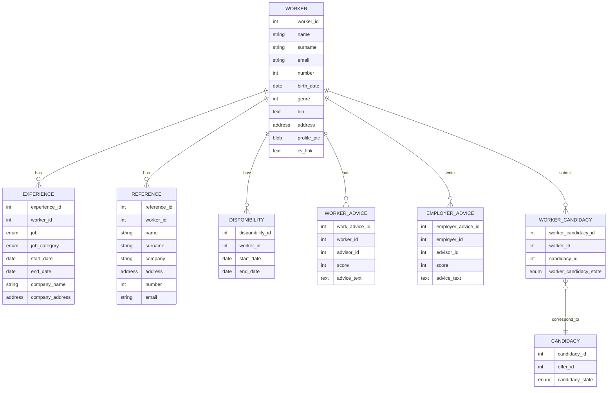

# Seasoning application overview

## Brief description
	
The **goal** of the application is to **put workers in relation with employers for seasonal jobs**. It simplifies the process of looking and applying for a job.

## User stories

To access the application, you need to **create an account**, filling it with your personal information, your resume and add a profile picture.
The user **may login** to the application using his email and password.

After his profile creation, the user is able to **add references, work experiences and availability in the *Profile* tab**
The user can **search for a job** using the search home page, or can apply to **recommended offers** showed depending on his profile.

If none offers is suitable for the worker, he is also available to **talk to any employers** using the *Employer* tab.

When the worker find an offer he wants to apply to, the *Apply* clickable button redirect to the *Messages* tab and start a new message channel between the candidate and the employer.

The candidate receive a **notification** if its candidacy is updated. It can be "On hold", "Accepted" or "Rejected". If the offer is closed, the worker is notified with a message in the employer message channel with its status ("Accepted" or "Rejected"). 

## Entrypoints

### Profile

- GET /profile
- PATCH /profile
- DELETE /profile
- PUT /profile/cv
- PUT /profile/profilePicture

### Authentication

- POST /login
- POST /register

### Profile components

- POST /profile/experience
- POST /profile/reference
- POST /profile/disponibility

- PUT /profile/experience/:experience_id
- PUT /profile/reference/:reference_id
- PUT /profile/disponibility/:disponibility_id

- DELETE /profile/experience/:experience_id
- DELETE /profile/reference/:reference_id
- DELETE /profile/disponibility/:disponibility_id

### Menu tab

- GET /offers
- GET /employers
- GET /messages (return last message sent to an employer in all conversations)

### Advice

- POST /profile/advice/worker/:worker_id
- POST /profile/advice/employer/:employer_id
- PUT /profile/advice/:advice_id
- DELETE /profile/advice/:advice_id

### Candidacy

- GET /offer/candidates
- POST /offer/candidate/:offer_id
- DELETE /offer/candidate/:offer_id
- PATCH /candidacy/:candidacy_id    (Used to modify the state of the candidacy)

### Message

- POST /message/:employer_id

## Mobile application models

## Database design

## Author

By RAIMBAULT Adrien and FONT Vincent

